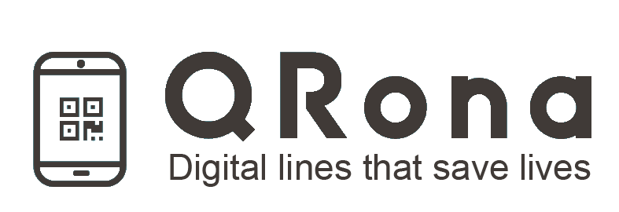
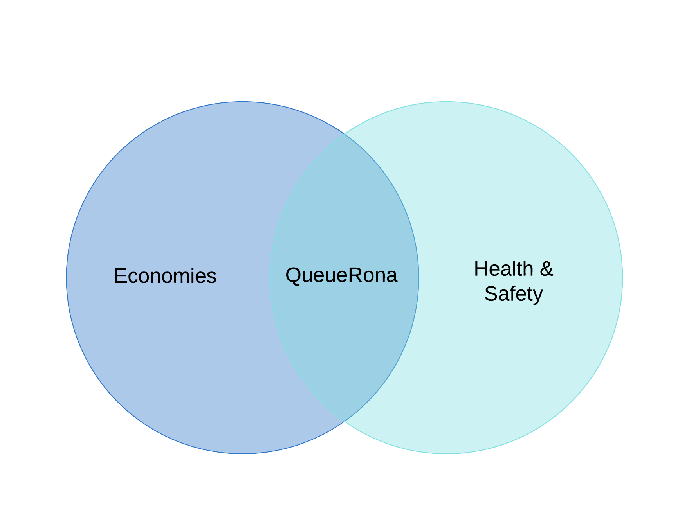

# QueueRona (QRona) COVID-19 MarketPlace Solution

## Business Mobile Application (Variant 2 of 3)

### Problem & Solution

During this pandemic coupled with immense pressure of social distancing, many businesses such as stores, and restaurants, were forced to either completely shut down or reduce operations to effective standstill. Our platform introduces pro-trade solutions for empowering businesses to reopen using a decentralized monitoring system which regulates overcrowding.

### How It Works

We designed QueueRona, an online platform that helps connect customers with business owners, while making sure social distancing measures are taking place. QueueRona offers markets affected by this pandemic the chance to reopen under social distancing regulations, COVID-19 tracing, footfall analytics, automatic onboarding, and regulations compliance. On the other hand, for customers, there would be no in-person queues, decreased infection rates, and broadcast COVID-19 alerts. Our software suite is fully scalable, with grocery stores, post offices, restaurants, and retail stores. Thermostats and Computer Vision will be added to ensure that a customers don't have high temperatures or any other symptoms.

### Presentation

[Google Doc](https://docs.google.com/presentation/d/1V7rKdhApVy4cM3EmOaQiirzUdQih0Qmc49NjfFjricg/edit?usp=sharing)

### Video Demonstration

[Youtube Link](https://www.youtube.com/watch?v=w_Q4tGMkQBY)

